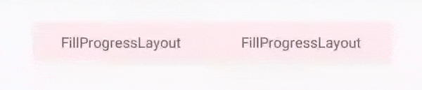
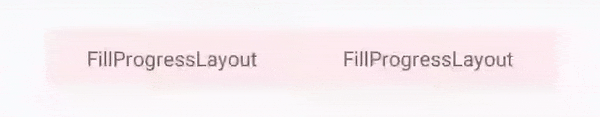
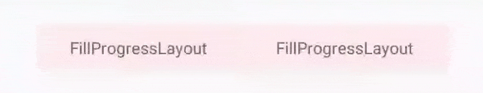
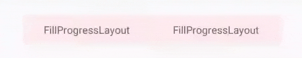
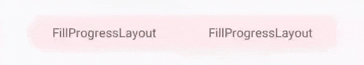

<div align="center">
  <kbd></kbd>
</div>

<h3 align="center">FillProgressLayout</h3>
<h4 align="center" >:fire:A simple and flexible Fill Progress Layout written in Kotlin:fire:</h4>

--------------

<a href="https://github.com/JDevZone/FillProgressLayout">

</a>

--------------
<h4 align="center" >Netflix button animation using FillProgressLayout</h4>

<a href="https://github.com/JDevZone/FillProgressLayout">

</a>

--------------

[](https://jitpack.io/#JDevZone/FillProgressLayout)
[](https://github.com/JDevZone/FillProgressLayout/blob/master/LICENSE)
[](https://android-arsenal.com/details/1/7840)
![GitHub code size in bytes](https://img.shields.io/github/languages/code-size/JDevZone/FillProgressLayout?logo=data:image/png;base64,iVBORw0KGgoAAAANSUhEUgAAAEAAAABACAMAAACdt4HsAAABRFBMVEUAAAAA//8AqqoAv79q6tVi69ht7dtm3cwQv59w389L4cNV1cZr5Ndm5tlt585o6NFq6tVm4NYJwadh3NNm5tUIv6dd4NFs6NFq59Rr49Vq5tVC1sFC1cFT28lr5tMJwaZr5dRp5tNq5NJQ28lq5dNQ3Mtq5NJp5NMJwqhr5tNr5tRQ28tS28kKwaZq5tMKwqdr5dRR3MlS2spr5NRR28pp5dNR28lq5NMJwaZp5dMLwacKwKdq5tJp5NNq5tNq5dJR28pQ3Mpq5NNq5dNq5dMKwahq5dNp5dNq5dNZ3s0KwqcKwadq5NMKwqdr5dNq5dNq5tNq5dNq5dNe4c5q5tNR28pf4c5q5dNR28pq5dNr5dNg4tBf4c9n5dIKwacLwagQw6oRxKs30rw40rxQ28dR28pR3Mhg4dBq5dOk7%2bTG9e7///%2bbCjGeAAAAXnRSTlMAAQMEDA0ODxAQERITFBUWGBkdHR4gISE1Nzw%2bQkdRVlhcYGNjZmdobG5wf4CEhIWImJmZmpudo6SnqaurrLW3urvAw8vMz9DR1tzd3eDh4%2bbo6u/w8fHx8vL5/f7%2bnPjfBgAAAWNJREFUeNrt0kdXQjEQBeB5YsGu2FFArNgbNgQRFQtgQ1RECTZ01P%2b/N3IgyCF5yTu4zLfL4t7M4oKmaVUMj88OUnafxwC%2bJUJiDpBwxAhZAL4oISTukOTjhJCo%2bILKGzqdbq/X7eyo/F98Qd0Woc764Ff7dCiJRcngVNuf/I4NpA1DoQxWyAQH5XnWMBJGjt1hljdvyL1mkSv7kmN5IVvg%2bR2F3p4CLC/Sc40mbvtBojuBphJdYKrhBCWO6sHMJkptgwkvKhgFocZLVHDVDCLLqGQRBJpSqOROdMIsMp8Uoug9Iyg4RuabQhS9D4FrAFULsBd4JtQLxoBnHcu%2bKBS/14DnAJXtA88FKjsHnntUloIywzVZ9Pih7KGUcRngz9dkBdK1FdxApLaCPWidXy06taCUmWsB7R%2bMU2yRylwGy%2bYpoPxWF0jlKVaQtrjAqoKIxQWygg0KKLZIObbAQlbTtIIfYmMHMd8lK1oAAAAASUVORK5CYII=)
[](https://jitpack.io/#JDevZone/FillProgressLayout)


<a align="center" href="https://github.com/JDevZone/FillProgressLayoutSupport">Support Library alternative is available here</a>

---------------------------
### Installation

1. Add it in your root build.gradle at the end of repositories:
```groovy
	allprojects {
		repositories {
			...
			maven { url 'https://jitpack.io' }
		}
	}
```


2. Add the dependency in app gradle

```groovy
	dependencies {
	        implementation 'com.github.JDevZone:FillProgressLayout:{latest_version}'
	}
```
### Basic usage

> As `FillProgressLayout` is direct child of `LinearLayout` you can replace LinearLayout with it as follows

```xml
<com.devzone.fillprogresslayout.FillProgressLayout
            android:id="@+id/fillL"
            android:layout_margin="30dp"
            app:fpl_backgroundColor="@color/colorRedTrans"
            app:fpl_progressColor="@color/colorGreenTrans"
            app:fpl_isRounded="false"
            app:fpl_progress="0"
            app:fpl_progressDuration="3000"
            app:fpl_progressDirection="left_to_right"
            app:fpl_shouldRestart="false"
            android:layout_width="match_parent"
            android:layout_height="wrap_content">
        <--childviews-->
    </com.devzone.fillprogresslayout.FillProgressLayout>
``` 
### Alternatively 
> You can use `FillProgressLayout` as background for other layouts. 

```xml
<RelativeLayout
            android:layout_width="match_parent"
            android:layout_height="wrap_content">
  
        <--as background for AppCompatTextView-->
        <com.devzone.fillprogresslayout.FillProgressLayout
                android:layout_alignBottom="@+id/tv"
                android:layout_alignParentTop="true"
                android:layout_width="match_parent"
                android:layout_height="wrap_content"/>

        <androidx.appcompat.widget.AppCompatTextView
                android:id="@+id/tv"
                android:text="@string/app_name"
                android:gravity="center"
                android:layout_width="match_parent"
                android:layout_height="wrap_content"/>
    </RelativeLayout>
``` 
### Samples

| Fill Direction | Demo |
| --- | :---: |
| <p align="center">Left To Right</p> |  |
| <p align="center">Right To Left</p> |  |
| <p align="center">Top To Bottom</p> |  |
| <p align="center">Bottom To Top</p> |  |

### Additional 
## Rounded Corners sample


## Gradient Progress sample



### Customisation

Here are the attributes you can specify through XML or related setters programatically:

* `fpl_backgroundColor` - Set background color.
* `fpl_progressColor` - Set progress color.
* `fpl_isRounded` - Set true if you need rounded corners.
* `fpl_roundedCornerRadius` - Set radius for round corners.
* `fpl_progress` - Set current progress.
* `fpl_progressDuration` - Set fill duration.
* `fpl_shouldRestart` - Set if progress filling should restart from 0.
* `fpl_progressDirection` - Set fill direction. i.e. `left_to_right`,`right_to_left`,`top_to_bottom` or `bottom_to_top`
* `fpl_gradientColors` - Set array of gradient colors i.e. `@array/gradientColors`
* `fpl_gradientMovement` - Set true for gradient movement with progress and false for static filling
* `fpl_gradientDirection` - Set Gradient direction. i.e. `left_to_right`,`right_to_left`,`top_to_bottom` ,                    `bottom_to_top`,`top_left_to_bottom_right`,`top_right_to_bottom_left`,`bottom_right_to_top_left` or`bottom_left_to_top_right`

### 📄 License

FillProgressLayout is released under the MIT license.
See [LICENSE](./LICENSE.txt) for details.


          

